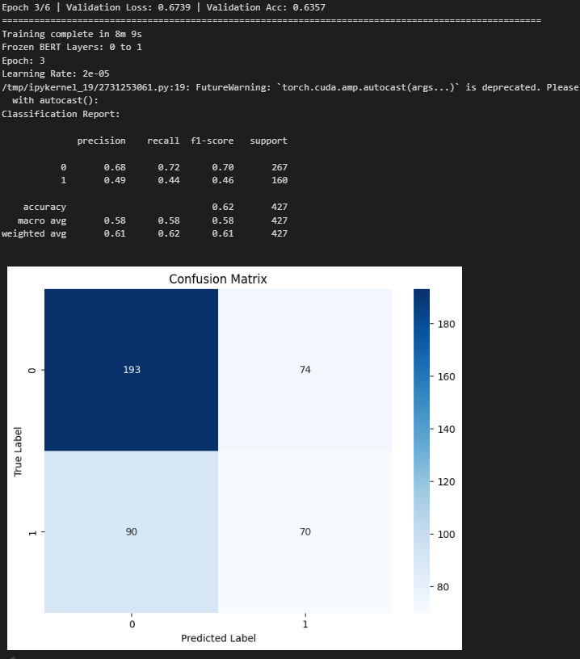
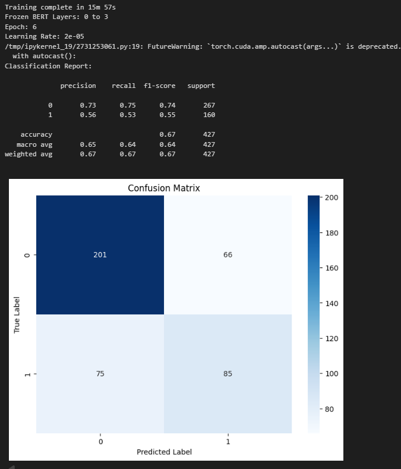
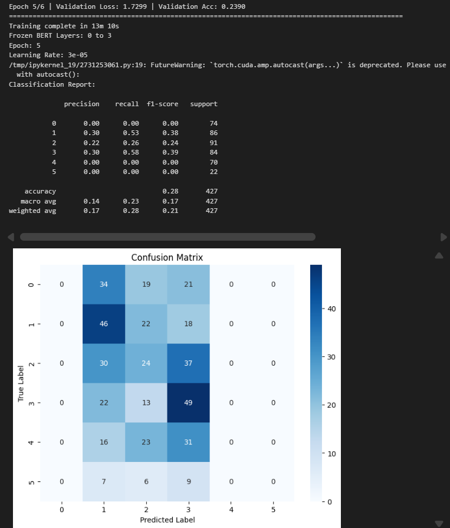

# Summary
This project implements a BERT–BiLSTM architecture for news sentiment classification by combining contextual embeddings from BERT with sequential modeling using BiLSTM. 
The model is trained on the [LIAR Fake News Dataset](https://www.kaggle.com/datasets/csmalarkodi/liar-fake-news-dataset), which consists of 14 feature columns and 6 sentiment classification labels. The project aims to evaluate the effectiveness of the model on large news dataset which has over 10000 datas
 

## Content
- [Requirements](#requirements)
- [Methods](#methods)
- [Steps](#steps)
- [Result](#result)

## Requirements
- PyTorch
- HuggingFace Transformers
- Scikit-learn
- Pandas
- NumPy
- Matplotlib

## Methods

### Data Preparation
- Remove missing values
- No text cleaning 
    * Since BERT preserves contextual meaning internally, standard text cleaning steps such as stopword removal or lemmatization are not suitable. 
- Construct metadata
    * Metadata is consist of fields like subject, speaker, context, etch. The metadata exclude credit scores since it's ambiguous in assigning numerical values to categorical attributes
    * Labels are divide to 6 classes, following the original dataset and 2 classes which is only `true` and `mostly-true` is classified as **True** and rest of other classes is **False** 
- Split the datas portion
    * The dataset is already split into training, validation, and testing parts. To reduce memory usage, this project use 80% of train, 50% of valid, 50% of test 

### Models
- BERT 
    * The BERT model uses `bert-base-uncased`, therefore manual lowercasing of the statements is not necessary. BERT produces contextual embedding vectors with a dimensionality of 768 for each token.
    
    * Input tokens are generated using the `BertTokenizer`, and each sequence is padded or truncated 
to a fixed length of 512 tokens

    * Each token is represented using token ID to access the model pre-train weight, and attention mask to mark if the ID is padding or not

    * Output of BERT model is a 768 dimensional vector for each token. At the beginning of each input sequence, a special `[CLS]` token is added, whose representation is commonly used as a global representation of the entire sequence

- BI-LSTM
    * Despite BERT meaningful vector representations, it still lack of information about token order. BI-LSTM is processing tokens from both directions that provide past and future contextual information.
    * This model uses 2 BI-LSTM layers that produce logits using softmax for both 6 or 2 multi-classes classification 

### Training and Evaluation
- Training is using `CrossEntropyLoss` as criterion and `AdamW` as optimizer
- The result is evaluated using accuracy, recall, precision, and F1-score
- Several conditions are tested to find the best case for both 6 or 2 multi-classes classification with:
    * number of epoch from 3 to 6
    * number of BERT layers to be frezed which is used is 2, 4, or 6 layers
    * BERT learning rate which is used is 2e-5 or 3e-5

## Steps
1. Load Dataset
- Load the LIAR Fake News Dataset and select relevant text, metadata, and label columns.
- Handle missing values and filter the dataset based on predefined proportions.
2. Construct Metadata
- Prepare 6 relevant columns by joining it as metadata
- The dataset now only consist of labels, metadata, and sentence
3. Tokenization and Encoding
- Tokenizing and encoding for both metadata and sentence to yield token ID and attention mask
- The token IDs and attention masks for both the input fields and the labels are loaded using a `DataLoader` with a batch size of 16 and fed into the BERT model
4. Model Training 
- During fine-tuning, a subset of 12 encoder layers won't be trained to reduce the risk of overfitting and to preserve the general linguistic knowledge learned during BERT pretraining
- For the classification task, the last_hidden_state from the BERT model—corresponding to the 12th encoder layer—is used. Specifically, only the `[CLS]` token representation from each sequence is extracted for both the metadata and the sentence inputs. These `[CLS]` representations are then concatenated to form a unified feature vector
- The concatenated representation is subsequently passed through two Bi-LSTM layers to capture bidirectional contextual dependencies. After obtaining the aggregated forward and backward representations, the output is flattened and fed into a classifier, which produces predictions for either 2 or 6 target labels

5. Evaluation
- For evaluation, there are 3 aspects that need to be experimented such as number of epochs, first N BERT encoder layers, and also learning rate for BERT model 
- During evaluation, the result will be displayed using confusion matrix and classification report

## Result

### 2 Lables 
- Based on accuracy metrics, the results range from 58% to 67%, suggesting that model performance is sensitive to architectural choices and hyperparameter selection.
- The best performance was achieved using a learning rate of 2e-5, freezing the first four encoder layers, and training for six epochs. The training dataset consists of 1,682 instances of class 0 and 1,007 instances of class 1, corresponding to distributions of 63% and 37%, respectively. As shown in the confusion matrix, the model exhibits a tendency to favor the majority class.

- Although the model achieves accuracy well above random guessing, it only marginally outperforms a majority-class baseline. This indicates that the model is biased toward the dominant class, a common effect of class imbalance

### 6 Lables
- Based on the observed results, increasing the number of classification labels appears to deteriorate the model’s ability to learn semantic representations. This leads to substantially degraded performance, with the model achieving only approximately 20% accuracy, while the best result reached 28%.
- The best performance was obtained using a learning rate of 3e-5, freezing the first four encoder layers, and training for five epochs. As shown in the confusion matrix, the model exhibited a strong bias toward predicting classes `1`, `2`, and `3`, while completely failing to predict classes `0`, `4`, and `5`. Consequently, these classes obtained zero precision, recall, and F1-scores. This behavior indicates that the model struggled to learn discriminative features across all classes and failed to generalize effectively, particularly for underrepresented or less separable categories.

### Conclusion
- Based on both labeling scenarios, the best results were obtained when the low-level encoder layers were fully frozen. Preserving these layers helps retain token-level and semantic features derived from the pretrained transfer learning model. Moreover, additional fine-tuning for 5–6 epochs enabled the model to better identify semantic patterns within sentences.
- However, both labeling scenarios suffer from the same limitation, as the model struggles to generalize across all classes. This behavior indicates overfitting, which is likely caused by class imbalance and insufficient learning of discriminative features

